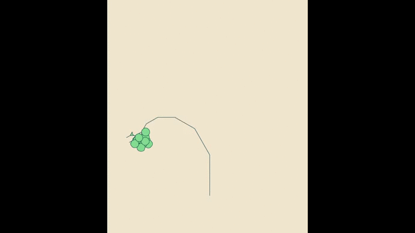
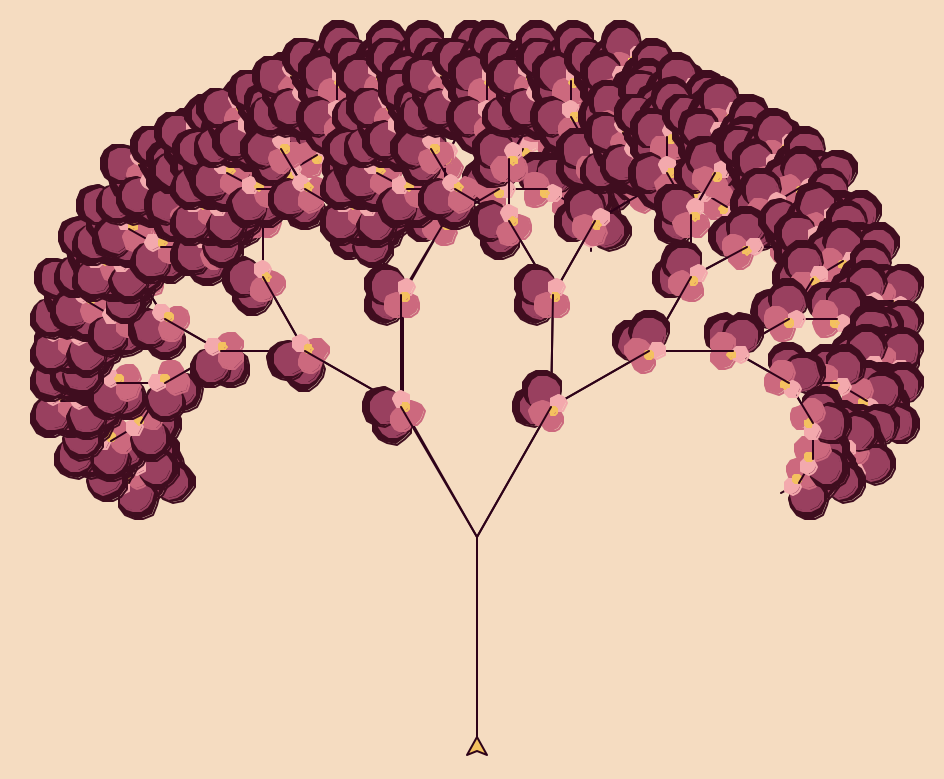
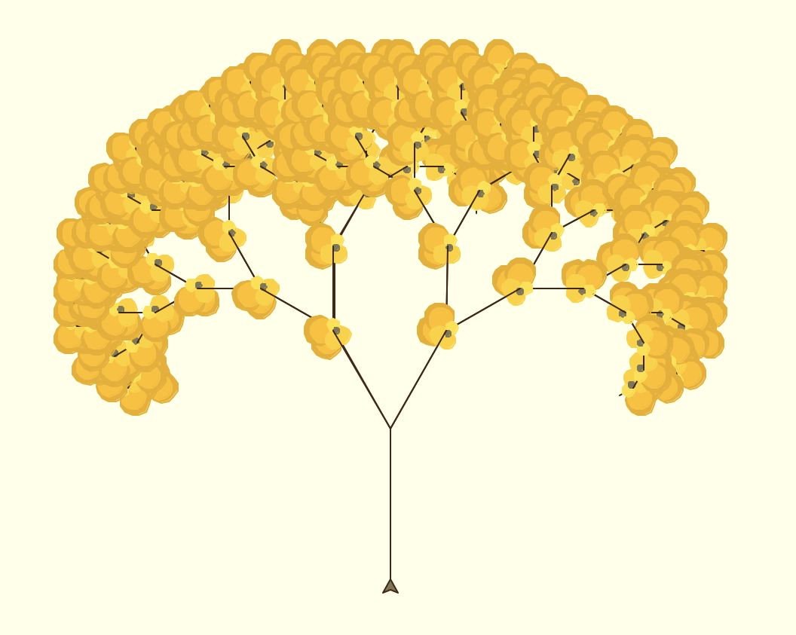
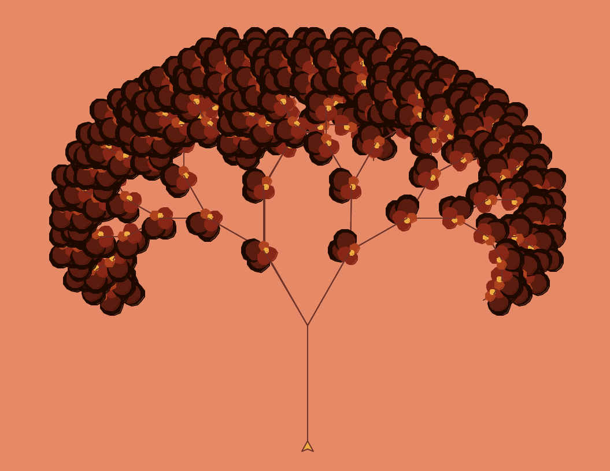
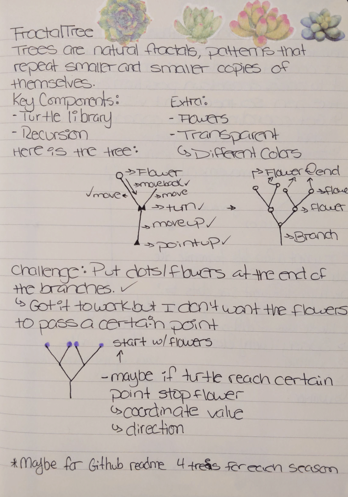
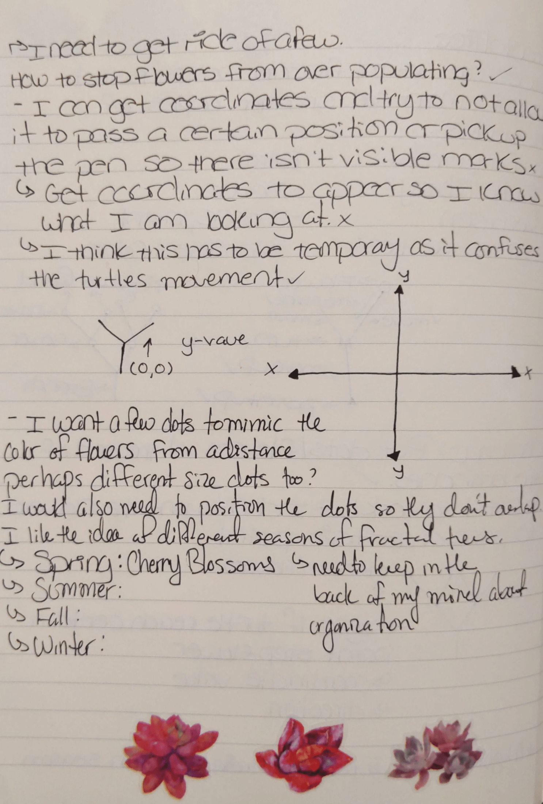
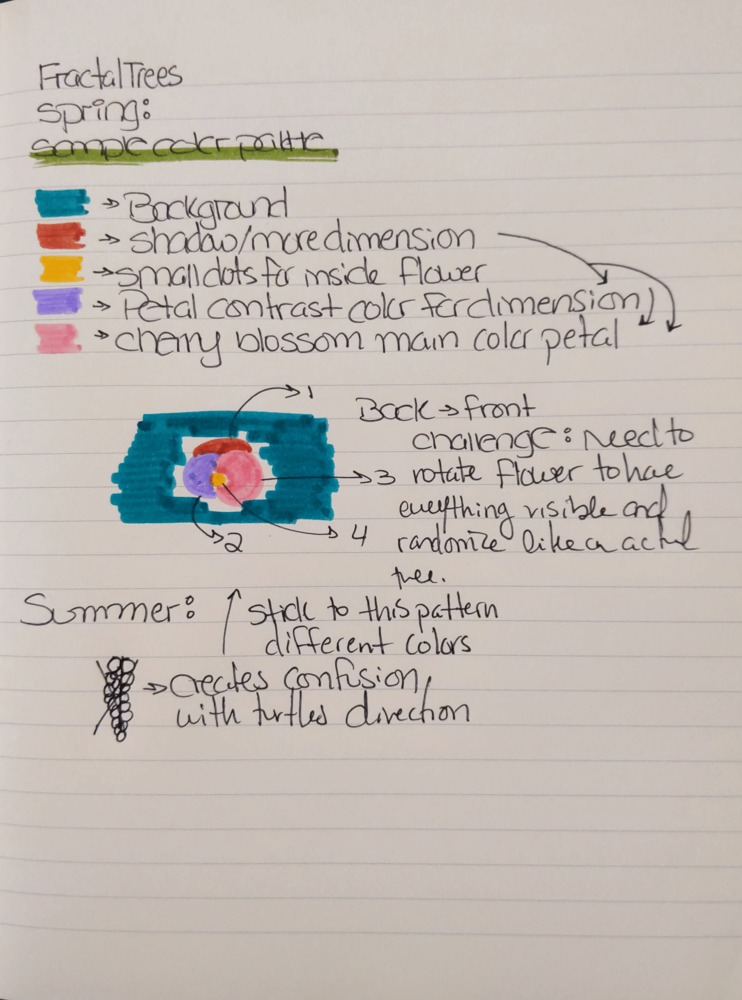

# FractalTree

Summary: Trees are natural fractals, patterns that repeat smaller and smaller copies of themselves. To imitate the growth pattern of a tree, I needed to implement a procedure that that calls itself over and over while avoiding an infinite loop. By using a recursive algorithm I was able to automate the tree branches growing off of each other within seconds. The FractalTrees project consisted of me demonstrating my knowledge of recursion and implementing it to the following application.

Here are a few variations of fractal tree's I created: 

Notes:

